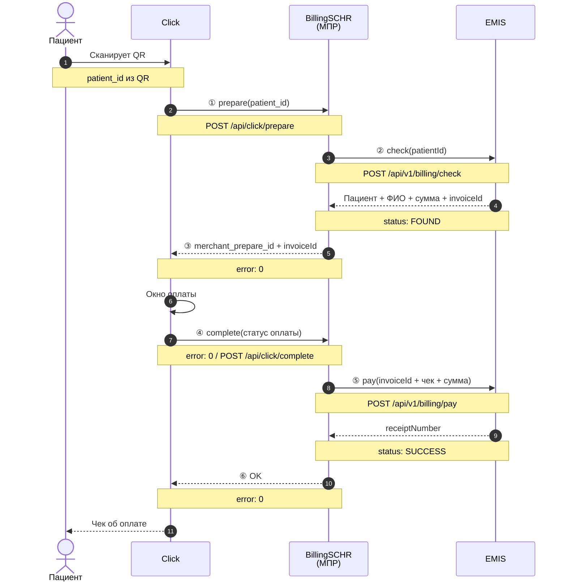
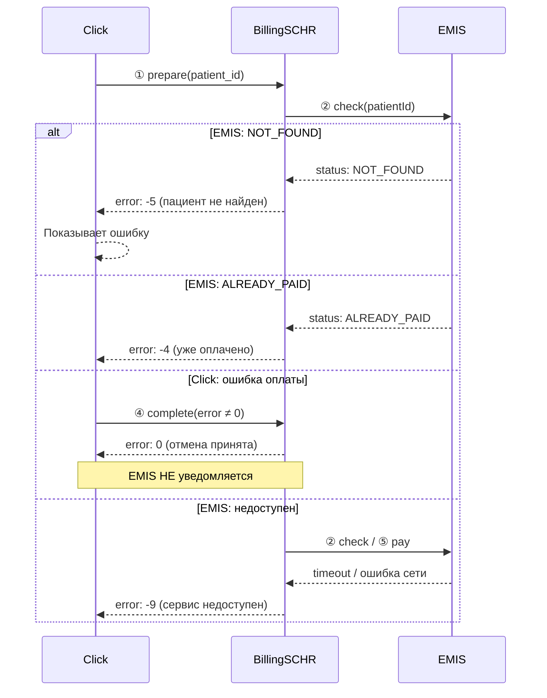
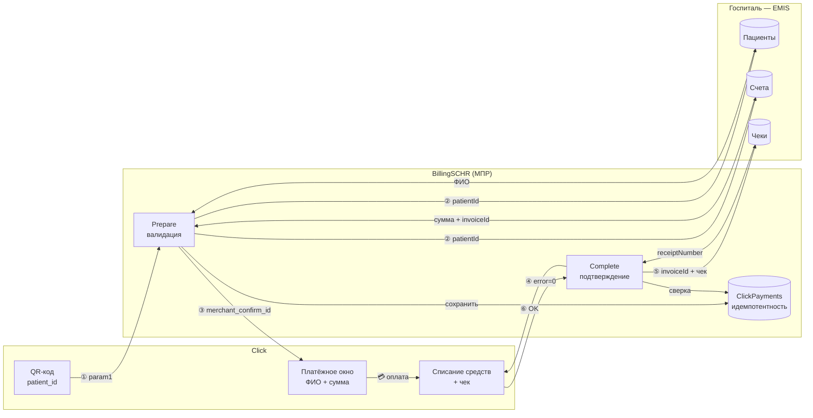

# API документация — Интеграция Click ↔ BillingSCHR ↔ EMIS

## Бизнес-процесс (диаграмма)



---

## Диаграмма ошибок (альтернативный сценарий)



---

## Диаграмма потоков данных



---

## 1. Click → BillingSCHR: Prepare

Клик запрашивает у нас данные пациента и сумму к оплате.

**Эндпоинт:** `POST /api/click/prepare`

### Запрос от Click:

```json
{
  "click_trans_id": 20240520001,
  "service_id": 2005,
  "merchant_trans_id": "MED-12345",
  "amount": 150000.00,
  "action": 0,
  "sign_time": "2024-05-20T10:30:00Z",
  "sign_string": "a1b2c3d4e5f6...",
  "error": 0,
  "param1": "PAT-001"
}
```

| Поле | Тип | Описание |
|---|---|---|
| `click_trans_id` | int64 | Уникальный ID транзакции Click |
| `service_id` | int | ID услуги |
| `merchant_trans_id` | string | ID заказа мерчанта |
| `amount` | decimal | Сумма (в тиынах/сумах) |
| `action` | int | 0 = prepare |
| `sign_string` | string | MD5-подпись |
| `param1` | string | **ID пациента** (из QR-кода) |

### Ответ BillingSCHR (успех):

```json
{
  "click_trans_id": 20240520001,
  "merchant_trans_id": "MED-12345",
  "merchant_prepare_id": "abc123def45678",
  "merchant_confirm_id": "INV-2024-001",
  "error": 0,
  "error_note": "Success"
}
```

| Поле | Тип | Описание |
|---|---|---|
| `error` | int | **0** = успех, иначе код ошибки |
| `merchant_prepare_id` | string | Наш внутренний ID (15 символов) |
| `merchant_confirm_id` | string | **ID счёта в EMIS** (invoiceId) |

### Коды ошибок:

| Код | Значение |
|---|---|
| `0` | Успех |
| `-2` | Неверная подпись / сумма не совпадает |
| `-4` | Услуга уже оплачена (EMIS: `ALREADY_PAID`) |
| `-5` | Пациент/счёт не найден (EMIS: `NOT_FOUND`) |
| `-9` | EMIS недоступен |

---

## 2. BillingSCHR → EMIS: Проверка задолженности

BillingSCHR запрашивает у EMIS данные пациента и сумму.

**Эндпоинт EMIS:** `POST {EmisBaseUrl}/api/v1/billing/check`

### Запрос:

```json
{
  "requestId": "550e8400-e29b-41d4-a716-446655440000",
  "patientId": "PAT-001",
  "serviceCode": null
}
```

| Поле | Тип | Описание |
|---|---|---|
| `requestId` | UUID | Уникальный ID запроса (идемпотентность) |
| `patientId` | string | **ID пациента** в EMIS |
| `serviceCode` | string? | Код услуги (опционально) |

### Ответ EMIS (успех — `FOUND`):

```json
{
  "requestId": "550e8400-e29b-41d4-a716-446655440000",
  "status": "FOUND",
  "patient": {
    "id": "PAT-001",
    "firstName": "Иван",
    "lastName": "Иванов",
    "middleName": "Иванович",
    "rank": "Майор"
  },
  "billing": {
    "invoiceId": "INV-2024-001",
    "totalAmount": 150000.00,
    "currency": "UZS",
    "purpose": "Консультация терапевта"
  }
}
```

| Поле | Тип | Описание |
|---|---|---|
| `status` | string | `FOUND` / `NOT_FOUND` / `ALREADY_PAID` |
| `patient.id` | string | **ID пациента** |
| `patient.lastName` + `firstName` + `middleName` | string | **Ф.И.О. пациента** |
| `billing.invoiceId` | string | **ID счёта** |
| `billing.totalAmount` | decimal | **Сумма к оплате** |
| `billing.currency` | string | Валюта (UZS) |
| `billing.purpose` | string | Назначение платежа |

### Ответ EMIS (ошибки):

```json
// NOT_FOUND
{ "status": "NOT_FOUND", "message": "Пациент не найден" }

// ALREADY_PAID
{ "status": "ALREADY_PAID", "message": "Услуга уже оплачена" }
```

---

## 3. BillingSCHR → Click: Возврат данных

После получения ответа от EMIS BillingSCHR возвращает Click:

| Что возвращаем | Откуда |
|---|---|
| `merchant_prepare_id` | Генерируем сами (15 символов) |
| `merchant_confirm_id` | `billing.invoiceId` из EMIS |
| `error` = 0 | Если EMIS вернул `FOUND` и сумма совпала |

Click показывает окно оплаты с ФИО пациента и суммой, списывает деньги.

---

## 4. Click → BillingSCHR: Complete

Click сообщает результат оплаты.

**Эндпоинт:** `POST /api/click/complete`

### Запрос от Click (успешная оплата):

```json
{
  "click_trans_id": 20240520001,
  "service_id": 2005,
  "merchant_trans_id": "MED-12345",
  "merchant_prepare_id": "abc123def45678",
  "merchant_confirm_id": "INV-2024-001",
  "amount": 150000.00,
  "action": 1,
  "sign_time": "2024-05-20T10:31:00Z",
  "sign_string": "f6e5d4c3b2a1...",
  "error": 0
}
```

| Поле | Тип | Описание |
|---|---|---|
| `error` | int | **0** = оплата прошла успешно |
| `merchant_prepare_id` | string | ID, полученный на шаге Prepare |
| `merchant_confirm_id` | string | invoiceId из EMIS |
| `amount` | decimal | Фактическая сумма списания |

### Ответ BillingSCHR:

```json
{
  "click_trans_id": 20240520001,
  "merchant_trans_id": "MED-12345",
  "merchant_confirm_id": "INV-2024-001",
  "error": 0,
  "error_note": "Success"
}
```

---

## 5. BillingSCHR → EMIS: Подтверждение оплаты

**Эндпоинт EMIS:** `POST {EmisBaseUrl}/api/v1/billing/pay`

### Запрос:

```json
{
  "requestId": "770e8400-e29b-41d4-a716-446655440001",
  "invoiceId": "INV-2024-001",
  "patientId": "PAT-001",
  "transaction": {
    "paymentId": "20240520001",
    "paymentMethod": "CLICK",
    "amount": 150000.00,
    "timestamp": "2024-05-20T10:31:00Z",
    "panMask": "8600****1234"
  }
}
```

### Ответ EMIS:

```json
{
  "requestId": "770e8400-e29b-41d4-a716-446655440001",
  "status": "SUCCESS",
  "receiptNumber": "RCPT-EMIS-2024-555"
}
```

| Поле | Тип | Описание |
|---|---|---|
| `status` | string | `SUCCESS` / `FAILED` |
| `receiptNumber` | string | Номер чека в EMIS |

---

## Итого: что передаётся между системами

| Шаг | От кого | Кому | Данные |
|---|---|---|---|
| ① Prepare | **Click** | BillingSCHR | `patient_id` (из QR) |
| ② Check | BillingSCHR | **EMIS** | `patientId` |
| ② Ответ | **EMIS** | BillingSCHR | `patient.id`, `patient.lastName + firstName + middleName` (ФИО), `billing.totalAmount` (сумма), `billing.invoiceId` (ID счёта) |
| ③ Ответ | BillingSCHR | **Click** | `merchant_prepare_id`, `merchant_confirm_id` = invoiceId, `error` = 0 |
| ④ Complete | **Click** | BillingSCHR | `click_trans_id`, `error` = 0 (оплачен) |
| ⑤ Pay | BillingSCHR | **EMIS** | `invoiceId`, `patientId`, `paymentId` (Click), `amount`, `timestamp` |
| ⑤ Ответ | **EMIS** | BillingSCHR | `status` = SUCCESS, `receiptNumber` |
| ⑥ Ответ | BillingSCHR | **Click** | `error` = 0 |

---

## Настройки (appsettings.json)

```json
{
  "EmisSettings": {
    "BaseUrl": "https://emis.med.mod.uz",
    "AuthToken": "Bearer-токен-от-EMIS",
    "TimeoutSeconds": 5
  },
  "ClickSettings": {
    "MerchantId": "19876",
    "ServiceId": "2005",
    "SecretKey": "секретный-ключ-Click"
  }
}
```

## Swagger

```
http://localhost:5121/swagger
```

Выбрать вкладку **«Интеграция Click + EMIS»** — там методы `prepare` и `complete` с примерами запросов/ответов.
